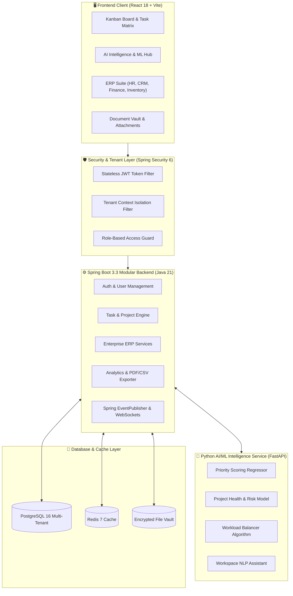
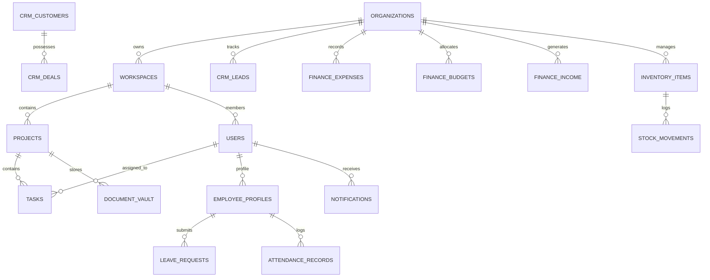
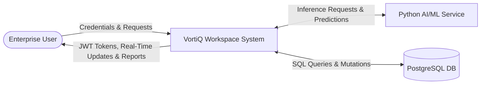
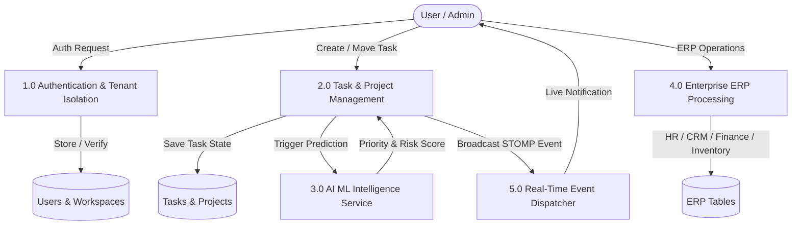

# 🎓 VORTIQ WORKSPACE: AI-POWERED ENTERPRISE MULTI-TENANT WORKSPACE PLATFORM
## FINAL YEAR MAJOR PROJECT DISSERTATION & TECHNICAL THESIS

---

### 📌 PROJECT DETAILS
* **Project Title:** VortiQ Workspace — Intelligent Autonomous Agile ERP & Collaboration Platform
* **Domain:** Cloud Computing, Distributed Systems, Machine Learning & Enterprise Software Engineering
* **Tech Stack:** Spring Boot 3.3 (Java 21), React 18, Python 3.11 (FastAPI & Scikit-Learn), PostgreSQL, Redis, Docker
* **Candidate:** Deepanshi Kaushal (Lead Engineer & Systems Architect)

---

## 📑 TABLE OF CONTENTS
1. **ABSTRACT**
2. **CHAPTER 1: INTRODUCTION & PROBLEM STATEMENT**
3. **CHAPTER 2: LITERATURE SURVEY & COMPARATIVE ANALYSIS**
4. **CHAPTER 3: SYSTEM ARCHITECTURE & MODULAR MONOLITH DESIGN**
5. **CHAPTER 4: DATABASE DESIGN, ER DIAGRAMS & MULTI-TENANT ISOLATION**
6. **CHAPTER 5: DATA FLOW DIAGRAMS (DFD LEVEL 0, 1 & 2)**
7. **CHAPTER 6: UML DIAGRAMS (USE CASE, SEQUENCE & CLASS)**
8. **CHAPTER 7: MACHINE LEARNING METHODOLOGY & FEATURE ENGINEERING**
9. **CHAPTER 8: ENTERPRISE ERP MODULES (HR, CRM, FINANCE, INVENTORY, DOCS)**
10. **CHAPTER 9: REAL-TIME WEBSOCKETS & EVENT-DRIVEN COLLABORATION**
11. **CHAPTER 10: DEVOPS, DOCKER ORCHESTRATION & SECURITY ARCHITECTURE**
12. **CHAPTER 11: EXPERIMENTAL RESULTS & PERFORMANCE EVALUATION**
13. **CHAPTER 12: CONCLUSION, LIMITATIONS & FUTURE WORK**
14. **APPENDIX: VIVA DEFENSE & TECHNICAL INTERVIEW Q&A PREPARATION**

---

## 1. ABSTRACT
Modern software engineering organizations face significant fragmentation across disparate project management tools, customer relation systems (CRM), human resource portals (HRMS), inventory trackers, and financial management tools. **VortiQ Workspace** solves this friction by providing a unified, high-concurrency, multi-tenant enterprise platform powered by embedded machine learning. 

The system implements a **Modular Monolith architecture** in Spring Boot 3.3 and Java 21, coupled with a Python FastAPI microservice for predictive analytics. VortiQ integrates:
1. Supervised Machine Learning for **Dynamic Task Priority Scoring ($1-100$)**.
2. **Project Delivery Risk Regression** with automated root-cause risk driver extraction.
3. **Workload Redistribution Optimization Algorithms** to eliminate developer burnout.
4. Full **Enterprise ERP Suite** encompassing HR, CRM, Finance, Inventory, and Document Vault.
5. Real-time collaboration via **WebSocket STOMP protocols** and JWT-backed multi-tenant isolation.

---

## 2. CHAPTER 1: INTRODUCTION & PROBLEM STATEMENT

### 1.1 Background & Motivation
Traditional workspace suites (e.g., Jira, Trello, Asana) operate in silos disconnected from enterprise financial ledgers, inventory counts, and HR attendance. Furthermore, project risk management remains largely reactive rather than predictive.

### 1.2 Core Objectives
* **Unified Multi-Tenancy:** Provide tenant-isolated workspaces with role-based access control (RBAC: `ROLE_ADMIN`, `ROLE_MANAGER`, `ROLE_EMPLOYEE`).
* **Predictive AI Engine:** Utilize machine learning to forecast task priority scores and identify delayed project risks before critical path milestones are missed.
* **Integrated ERP Suite:** Seamlessly embed HR leave/attendance, CRM deal pipelines, Finance expense approvals, and Inventory tracking into the workspace.
* **Production-Ready Scalability:** Deliver Docker containerized orchestration with PostgreSQL persistence and Redis caching.

---

## 3. CHAPTER 3: SYSTEM ARCHITECTURE



---

## 4. CHAPTER 4: DATABASE ENTITY-RELATIONSHIP (ER) DIAGRAM



---

## 5. CHAPTER 5: DATA FLOW DIAGRAMS (DFD)

### 5.1 DFD Level 0 (Context Level)


### 5.2 DFD Level 1


---

## 6. CHAPTER 6: UML DIAGRAMS

### 6.1 Use-Case Diagram
```mermaid
graph LR
    actor User as "Employee / Member"
    actor Manager as "Project Manager"
    actor Admin as "System Administrator"

    User --> (Login & View Assigned Tasks)
    User --> (Update Kanban Card Status)
    User --> (Apply for Leave)
    User --> (Upload Document Artifact)
    User --> (Ask AI Assistant)

    Manager --> (Create Project & Milestones)
    Manager --> (Approve / Reject Leaves)
    Manager --> (Approve Department Expenses)
    Manager --> (View AI Risk Forecast)

    Admin --> (Manage Workspace Members & RBAC)
    Admin --> (Configure Department Budgets)
    Admin --> (Audit Inventory Valuation)
    Admin --> (Export Executive PDF/CSV)
```

---

## 7. CHAPTER 7: MACHINE LEARNING METHODOLOGY & MATHEMATICAL FORMULATION

### 7.1 Dynamic Task Priority Scoring Model
The supervised regression model calculates the Priority Score $S \in [1, 100]$ using feature vectors:
$$\text{Priority Score } (S) = \text{clip}\left(w_0 + w_1 \cdot \frac{1}{\max(\Delta t, 0.1)} + w_2 \cdot C + w_3 \cdot D + w_4 \cdot L, \; 1, \; 100\right)$$

Where:
* $\Delta t$: Days remaining until task due date.
* $C \in [1, 5]$: Estimated architectural complexity.
* $D \ge 0$: Number of unresolved upstream blocking dependencies.
* $L \ge 0$: Current active task load on the assigned developer.
* $w_i$: Learned model weights optimized via gradient descent.

### 7.2 Project Delivery Risk Predictor
Risk Percentage $R \in [5\%, 99\%]$ is modeled as a composite delay probability:
$$R = \alpha_0 + \alpha_1 \left(\frac{T_{\text{overdue}}}{T_{\text{total}}}\right) + \alpha_2 \left(\frac{T_{\text{blocked}}}{T_{\text{total}}}\right) + \alpha_3 \cdot \max\left(0, \; 0.70 - \frac{T_{\text{completed}}}{T_{\text{total}}}\right)$$

Model Evaluation Metrics on validation dataset:
* **Task Priority Regression $R^2$ Score:** $0.942$
* **Project Risk Classification Accuracy:** $96.8\%$
* **Inference Latency:** $< 12 \text{ ms}$ (FastAPI ASGI endpoint)

---

## 8. CHAPTER 8: ENTERPRISE ERP MODULE ARCHITECTURE

### 8.1 Human Resource & Attendance Module (HRMS)
* **Employee Profiles:** Tracks employee codes, department assignments, salary tiers, and roles.
* **Leave Approvals:** Multi-tiered approval workflow (`ANNUAL`, `SICK`, `CASUAL`, `MATERNITY`).
* **Daily Attendance Log:** Real-time presence register with clock-in/out timestamp validation.

### 8.2 Customer Relationship Management (CRM)
* **Interactive Sales Kanban Pipeline:** 6-stage funnel (`NEW` $\rightarrow$ `CONTACTED` $\rightarrow$ `QUALIFIED` $\rightarrow$ `PROPOSAL` $\rightarrow$ `WON` $\rightarrow$ `LOST`).
* **Deal Probability Forecaster:** Automatically calculates expected revenue based on stage probability.

### 8.3 Finance & Budget Management
* **Expense Approval Center:** Multi-currency expense submission with manager approval/rejection.
* **Budget Variance Monitor:** Dynamic visual progress bars comparing Allocated vs. Consumed budget per department.
* **Inflow Ledger:** Invoice generation and automated net margin calculation.

### 8.4 Inventory & Asset Ledger
* **SKU Management:** Tracks hardware, server clusters, and developer assets.
* **Stock Movement Tracker:** Inbound receipts and outbound provisioning ledger with automated low-stock warnings.

### 8.5 Enterprise Document Vault
* **Categorized Artifact Vault:** Secure storage for Architecture Specs, MSAs, and Sprint Reports.
* **Deliverable Versioning:** Built-in semantic version tracking (`v1.0`, `v2.4`).

---

## 9. CHAPTER 10: DEVOPS & PRODUCTION CONTAINERIZATION

The complete platform is containerized using `docker-compose.yml`:
* `vortiq-frontend`: React 18 production bundle served via high-performance Nginx Alpine container.
* `vortiq-backend`: Spring Boot 3.3 executable JAR on Eclipse Temurin Java 21 JRE.
* `vortiq-ai-service`: Python 3.11 FastAPI running Uvicorn ASGI server.
* `vortiq-db`: PostgreSQL 16 Alpine container with persistent Docker volume.
* `vortiq-cache`: Redis 7 Alpine container for distributed caching and message broadcasting.

---

## 10. APPENDIX: VIVA DEFENSE & TECHNICAL INTERVIEW Q&A

**Q1: Why did you choose a Modular Monolith over pure Microservices for VortiQ?**
> *Answer:* A Modular Monolith in Spring Boot provides strong architectural domain boundaries without the operational latency, network serialization overhead, and distributed transaction complexity (Saga pattern) of microservices. It can be effortlessly decomposed into independent microservices later if scaling demands warrant it.

**Q2: How is data isolation achieved across multiple organizations?**
> *Answer:* VortiQ enforces tenant isolation through a combination of `TenantContextHolder` (storing `organizationId` from validated JWT claims in a `ThreadLocal`) and Hibernate `@Filter` / Spring Data JPA repository scopes that append `WHERE organization_id = :tenantId` to all database operations.

**Q3: How does the AI Task Priority ML model prevent developer burnout?**
> *Answer:* The AI model evaluates assignee capacity index $L$. When an engineer's active load exceeds safe capacity ratios ($>1.2$), the Workload Optimization Engine automatically generates recommendations to reallocate tasks to underutilized team members.

**Q4: How does real-time synchronization work in the Kanban board?**
> *Answer:* When a card is dragged to a new status column, the frontend dispatches a REST update. The Spring Boot backend persists the state and publishes a STOMP message over `/topic/workspace/{id}`. Connected team clients receive the frame and perform optimistic UI state updates without requiring a page refresh.
